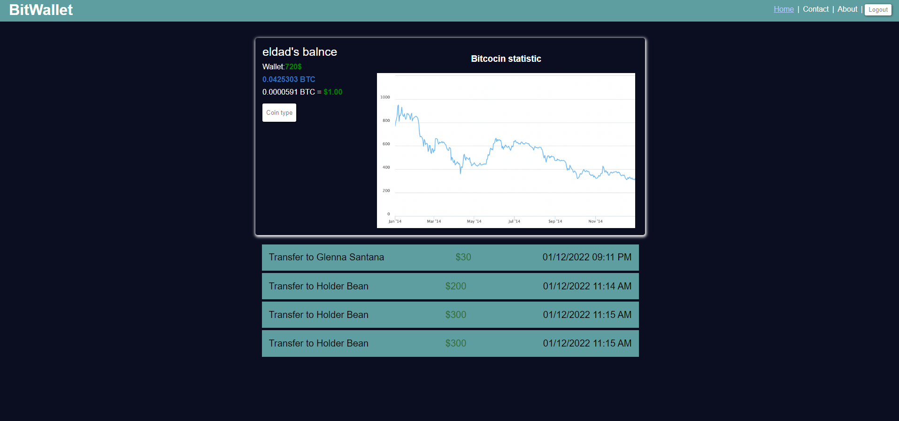
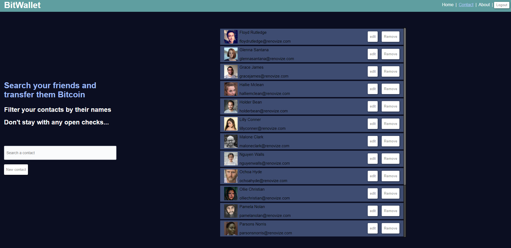
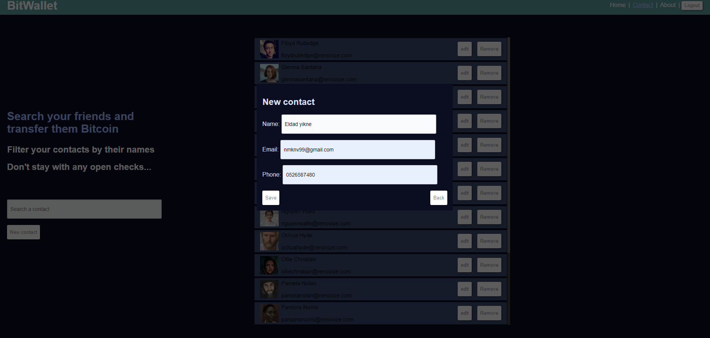

<!-- Improved compatibility of back to top link: See: https://github.com/othneildrew/Best-README-Template/pull/73 -->
<a name="readme-top"></a>
<!--
*** Thanks for checking out the Best-README-Template. If you have a suggestion
*** that would make this better, please fork the repo and create a pull request
*** or simply open an issue with the tag "enhancement".
*** Don't forget to give the project a star!
*** Thanks again! Now go create something AMAZING! :D
-->


<!-- PROJECT SHIELDS -->
<!--
*** I'm using markdown "reference style" links for readability.
*** Reference links are enclosed in brackets [ ] instead of parentheses ( ).
*** See the bottom of this document for the declaration of the reference variables
*** for contributors-url, forks-url, etc. This is an optional, concise syntax you may use.
*** https://www.markdownguide.org/basic-syntax/#reference-style-links
-->

[![LinkedIn][linkedin-shield]][linkedin-url]


<!-- PROJECT LOGO -->
<br />
<div align="center">
    
  <h3 align="center">misterBit </h3>

  
</div>


<!-- ABOUT THE PROJECT -->
## About The Project

An app I wrote with Vue, in which you can transfer money to your fake contacts, CRUDL them and get information about the current Bitcoin value, the market price and more! [ Take a look, it's on Github pages!](https://eldadyikne.github.io/misterbit_Angular/#/)

  </a>

#### Table of Contents
  <ul>
    <li>
      <a href="#about-the-project">About The Project</a>
    </li>
    <li>
      <a href="#getting-started">Getting Started</a>
    </li>
    <li><a href="#description">Description</a></li>
    <li><a href="#contact">Contact</a></li>
    <li><a href="#showcase">Showcase</a></li>
  </ul>


### Built With


* [![Angular][Angular.io]][Angular-url]
* [![Bootstrap][Bootstrap.com]][Bootstrap-url]
* [![TypeScript][TypeScript.com]][TypeScript-url]
* [![Sass][Sass.com]][Sass-url]

<p align="right">(<a href="#readme-top">back to top</a>)</p>


<!-- GETTING STARTED -->
## Getting Started


### Installation


1. Clone the repo
   ```sh
    git clone https://github.com/eldadYikne/misterbit_Angular.git

   ```
2. Install NPM packages
   ```sh
   npm install
   ```
3. Open the terminal and enter the following line

   ```js
   npm run dev
   ```

<p align="right">(<a href="#readme-top">back to top</a>)</p>


<!-- USAGE EXAMPLES -->
## Description

I decided to learn a new framework, because I want to keep expanding my knowladge and try new chalanges. That was my motivation.

And a bit about the project - a small App that was built in a few days, which provides the user a list of contacts that they can transfer money to, a basic CRUDL and some information about the value of theirs fake bank currency in Bitcoin.

#### Technologies

- Angular
- Observable
- RouterLink
 -Pipes
- Sass
- Angulat ng & Github pages
<p align="right">(<a href="#readme-top">back to top</a>)</p>


<!-- CONTACT -->
## Contact

Eldad yikne - [Linkedin](https://www.linkedin.com/404/) - nmknv99@gmail.com

Project Link: [https://eldadyikne.github.io/misterbit_Angular/#/](https://eldadyikne.github.io/misterbit_Angular/#/)

<p align="right">(<a href="#readme-top">back to top</a>)</p>


<!-- ACKNOWLEDGMENTS -->
## Showcase

### Sign-up page


### Your contacts
You can view your different contacts, filter them by name. 
In addition, you can transform money, randomly, to one of your contacts by pressing on the contact and transfer. You would get a message about the details right after, of course.


### transfer to contact


### Add a new contact
In the same page, you can click on the button "Add a new contact", and the right fields would appear.



<p align="right">(<a href="#readme-top">back to top</a>)</p>


<!-- MARKDOWN LINKS & IMAGES -->
<!-- https://www.markdownguide.org/basic-syntax/#reference-style-links -->
[contributors-shield]: https://img.shields.io/github/contributors/othneildrew/Best-README-Template.svg?style=for-the-badge
[contributors-url]: https://github.com/othneildrew/Best-README-Template/graphs/contributors
[forks-shield]: https://img.shields.io/github/forks/othneildrew/Best-README-Template.svg?style=for-the-badge
[forks-url]: https://github.com/othneildrew/Best-README-Template/network/members
[stars-shield]: https://img.shields.io/github/stars/othneildrew/Best-README-Template.svg?style=for-the-badge
[stars-url]: https://github.com/othneildrew/Best-README-Template/stargazers
[issues-shield]: https://img.shields.io/github/issues/othneildrew/Best-README-Template.svg?style=for-the-badge
[issues-url]: https://github.com/othneildrew/Best-README-Template/issues
[license-shield]: https://img.shields.io/github/license/othneildrew/Best-README-Template.svg?style=for-the-badge
[license-url]: https://github.com/othneildrew/Best-README-Template/blob/master/LICENSE.txt
[linkedin-shield]: https://img.shields.io/badge/-LinkedIn-black.svg?style=for-the-badge&logo=linkedin&colorB=555
[linkedin-url]: https://www.linkedin.com/in/eldad-yikne-639407247/
[product-screenshot]: images/screenshot.png
[Next.js]: https://img.shields.io/badge/next.js-000000?style=for-the-badge&logo=nextdotjs&logoColor=white
[Next-url]: https://nextjs.org/
[React.js]: https://img.shields.io/badge/React-20232A?style=for-the-badge&logo=react&logoColor=61DAFB
[React-url]: https://reactjs.org/
[Vue.js]: https://img.shields.io/badge/Vue.js-35495E?style=for-the-badge&logo=vuedotjs&logoColor=4FC08D
[Vue-url]: https://vuejs.org/
[Angular.io]: https://img.shields.io/badge/Angular-DD0031?style=for-the-badge&logo=angular&logoColor=white
[Angular-url]: https://angular.io/
[Svelte.dev]: https://img.shields.io/badge/Svelte-4A4A55?style=for-the-badge&logo=svelte&logoColor=FF3E00
[Svelte-url]: https://svelte.dev/
[Laravel.com]: https://img.shields.io/badge/Laravel-FF2D20?style=for-the-badge&logo=laravel&logoColor=white
[Laravel-url]: https://laravel.com
[Bootstrap.com]: https://img.shields.io/badge/Bootstrap-563D7C?style=for-the-badge&logo=bootstrap&logoColor=white
[Bootstrap-url]: https://getbootstrap.com
[TypeScript.com]: https://img.shields.io/badge/TypeScript-0202d1?style=for-the-badge&logo=TypeScript&logoColor=white
[TypeScript-url]: https://www.typescriptlang.org/
[Sass.com]:https://img.shields.io/badge/Sass-red?style=for-the-badge&logo=Sass&logoColor=white
[Sass-url]: https://sass-lang.com/
[JQuery.com]: https://img.shields.io/badge/jQuery-0769AD?style=for-the-badge&logo=jquery&logoColor=white
[JQuery-url]: https://jquery.com 
